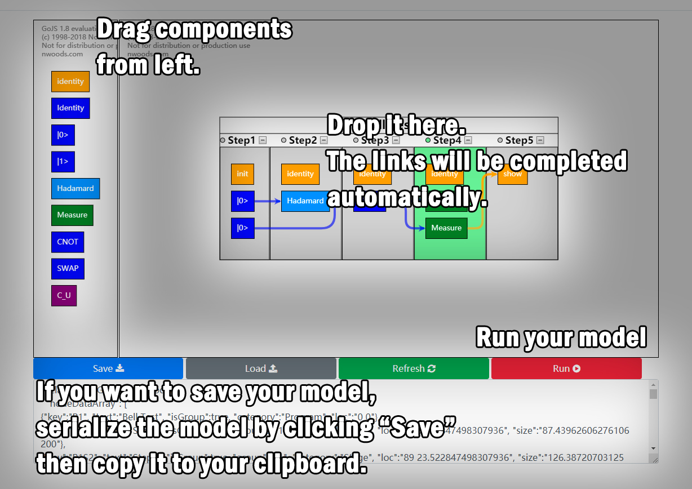
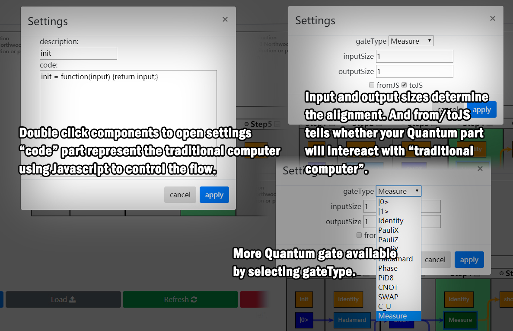
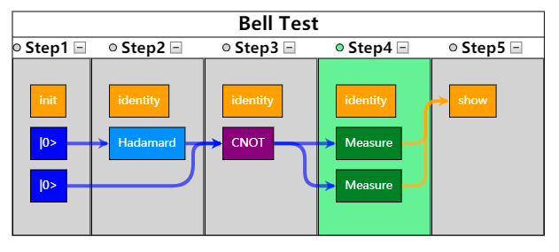
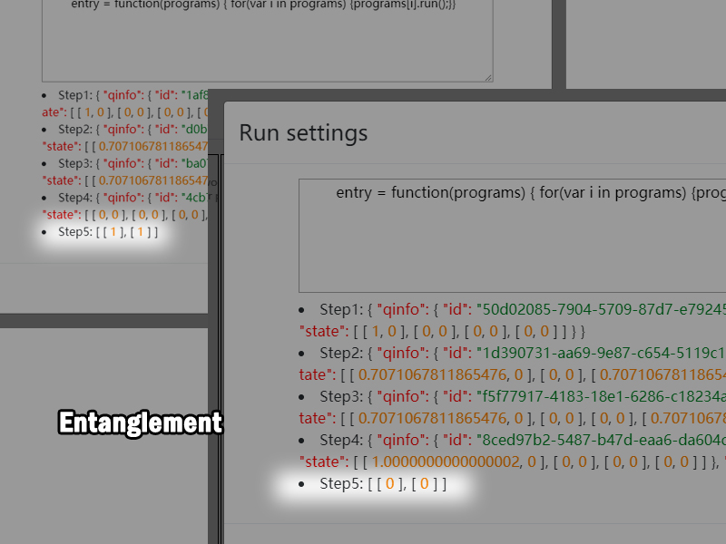
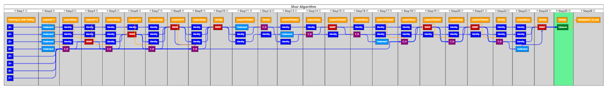
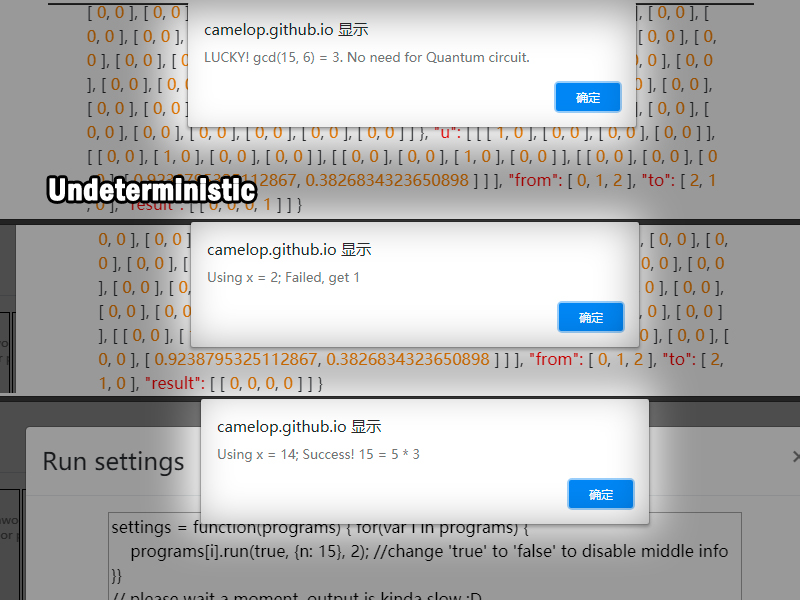
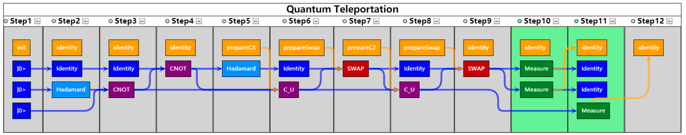
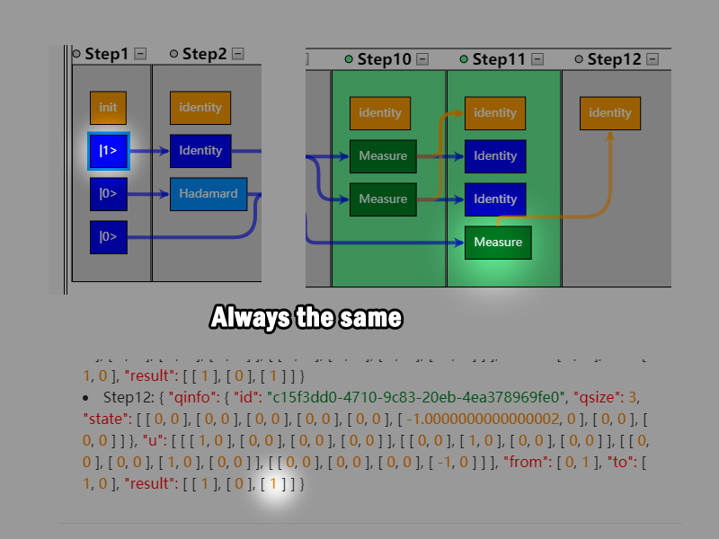

# **Qu**Playground

A new way to test your ideas about quantum circuit. 

## A brief guide

## Examples

## Bell test

A Bell test experiment or Bell's inequality experiment, also simply a Bell test, is a real-world physics experiment . In this demonstration you can see the interesting result when measuring a pair of EPR. 

## Shor algorithm

Shor's algorithm, named after mathematician Peter Shor, is a quantum algorithm for integer factorization.  In this demonstration we implement a simple case for N = 3 * 5 to show some features of quantum computing like undeterministic. 

## Quantum teleportation

Quantum teleportation is a process by which quantum information from one location to another.  In this demonstration you will see that first bit is "teleported" to the third bit. (You can change the first bit, run it again and again, and use the result of measurement to check that.) 

